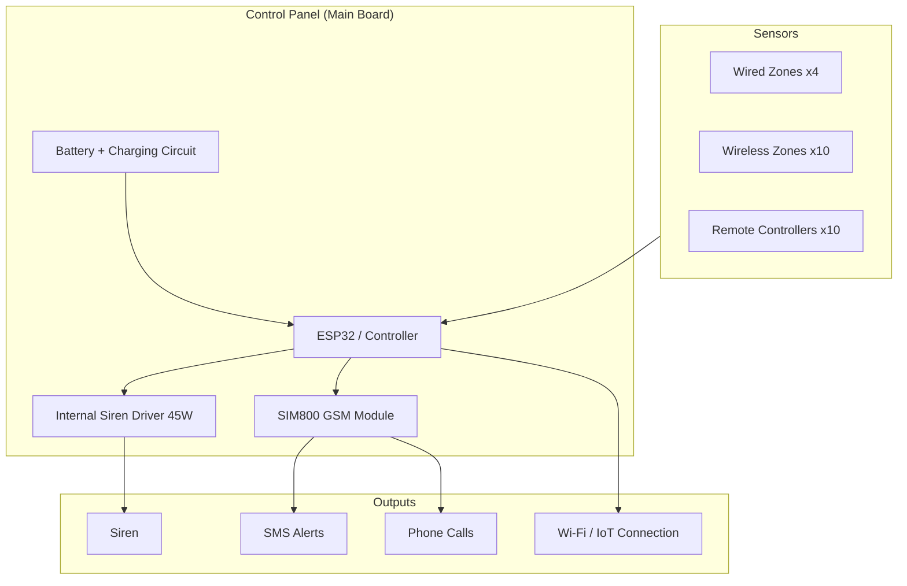
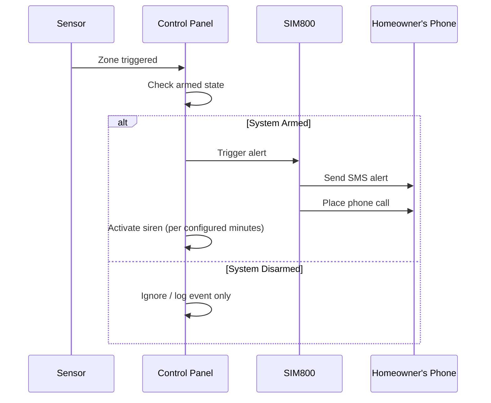
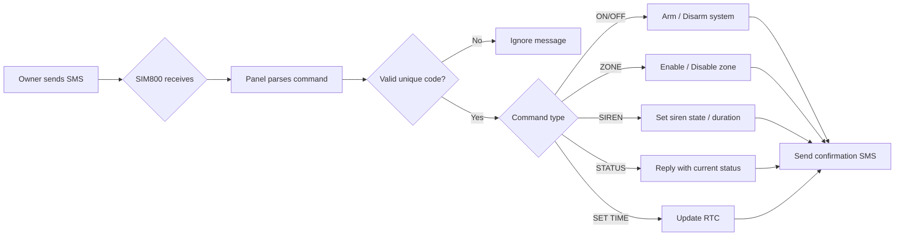

# Home Security System Based on SIM800

A GSM/SIM800-based home security system that detects unauthorized entry and alerts the homeowner via SMS and phone call. The system consists of a control panel (main board), sensors, and sirens, and can be controlled remotely over SMS.

---

## Table of Contents

- [Overview](#overview)
- [System Architecture](#system-architecture)
- [Features](#features)
- [Alarm Trigger Flow](#alarm-trigger-flow)
- [Hardware Setup](#hardware-setup)
- [SMS Command Reference](#sms-command-reference)
- [SMS Command Flow](#sms-command-flow)
- [License](#license)

---

## Overview

The sensors can be placed on doors, windows, and other areas around the home to detect movement or disturbance. When triggered, the control panel sends calls and text messages to the homeowner's phone. The system can also be armed, disarmed, and queried remotely via SMS from anywhere.

This project has been tested for 4000+ hours of operation.

---

## System Architecture

---

## Features

| Category | Details |
|---|---|
| Wired zones | 4 |
| Wireless zones | 10 |
| Remote controllers | Up to 10 |
| Stored phone numbers | Up to 10 |
| Battery | Internal charging + protection circuit |
| Siren | 45W internal siren circuit |
| Antenna | External SMA socket for SIM800 |
| Connectivity | Wi-Fi (IoT) |
| Control | Full on/off/settings control via SMS |

---

## Alarm Trigger Flow

---

## Hardware Setup

| Action | Procedure | Confirmation |
|---|---|---|
| Learn wireless sensor | Hold board button 3s (2 beeps), release, then power the sensor | 2 beeps = success, 1 beep = error |
| Remove wireless sensor | Hold button 3s (2 beeps), release, then power the sensor | 3 beeps = success, 1 beep = error |
| Learn remote's Activate button | Hold button 6s (3 beeps), press remote's Activate button | 2 beeps = success, 1 beep = error |
| Remove remote's Activate button | Hold button 6s (3 beeps), release, press remote's Activate button | 3 beeps = success, 1 beep = error |
| Learn remote's Disable button | Hold button 9s (4 beeps), press remote's Disable button | 2 beeps = success, 1 beep = error |
| Remove remote's Disable button | Hold button 9s (4 beeps), release, press remote's Disable button | 3 beeps = success, 1 beep = error |
| Cancel learn/remove process | Press settings button | 1 beep = cancelled |
| Erase all remotes & sensors | Hold button 20s | 5 beeps = memory erased |

---

## SMS Command Reference

| Action | Command | Example |
|---|---|---|
| Save mobile number | `<UniqueCode>;<number>` | `RIJ111111111111111;09191111111` |
| Get status of mobile number | `<UniqueCode>` | `RIJ111111111111111` |
| Delete mobile number | `<UniqueCode>;<number>` | `RIJ111111111111111;09191111111` |
| Activate device | `RIJ ON` | |
| Disable device | `RIJ OFF` | |
| Activate alarm | `RIJ SIREN ON` | |
| Disable alarm | `RIJ SIREN OFF` | |
| Enable notification beep | `RIJ BEEP ON` | |
| Disable notification beep | `RIJ BEEP OFF` | |
| Enable zone | `RIJ ZONE <N> ON` | `RIJ ZONE 1 ON` |
| Disable zone | `RIJ ZONE <N> OFF` | `RIJ ZONE 1 OFF` |
| Set alarm duration | `RIJ SIREN <minutes>` | `RIJ SIREN 15` |
| Send USSD code | `RIJ UCODE:<code>` | `RIJ UCODE:*11111*11111#` |
| Set device time | `RIJ SET TIME:<time>+<tz>` | `RIJ SET TIME:22/05/09,23:59:59+18` |
| Get device status | `RIJ STATUS` | |
| Get zone status | `RIJ STATUS ZONE` | |
| Reset device | `RIJ RESET` | |

> Full implementation details: [`Src/COM.ino`](Src/COM.ino)

---

## SMS Command Flow

---

## License

[MIT License](LICENSE) — Free Hardware!

